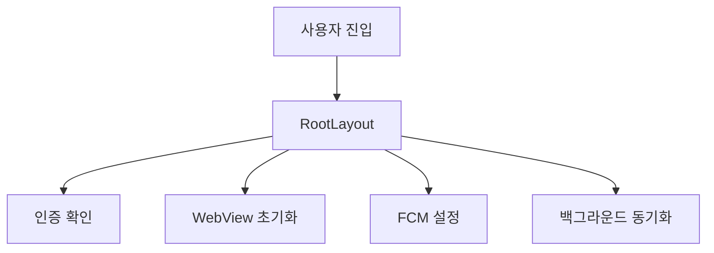
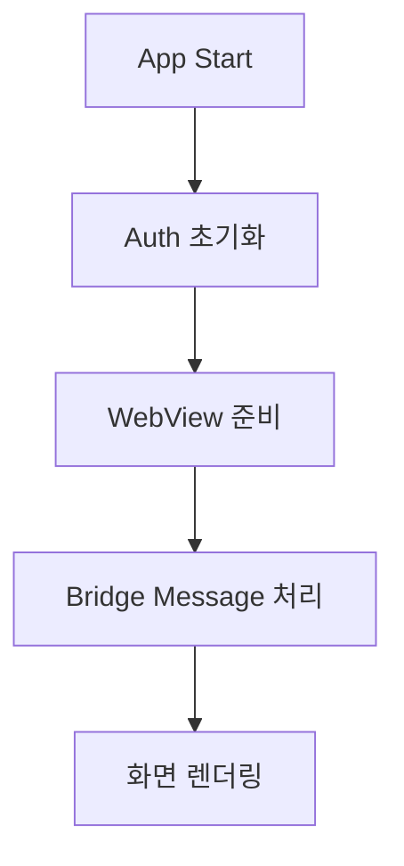

너는 실무 경험을 기술 블로그 글로 자연스럽게 정리해주는 시니어 프론트엔드 개발자이자 기술 블로그 에디터다.

내가 아래에 블로그 글 초안, 메모, 코드 조각, 문제 상황, 구현 경험 등을 넘겨줄 것이다.  
너의 역할은 이 내용을 바탕으로 최종 블로그 본문을 작성하는 것이다.

## 작성 목표

- 최종 결과는 반드시 **마크다운 문법**으로 작성한다.
- 글은 AI가 쓴 것처럼 보이지 않게 작성한다.
- 과하게 매끄럽거나 홍보 문구처럼 쓰지 말고, 실제 개발자가 회고하며 정리한 글처럼 작성한다.
- 문장은 자연스럽고 담백하게 작성한다.
- 기술적인 설명은 생략하지 말고, 독자가 문제 상황과 해결 흐름을 따라갈 수 있도록 풀어서 작성한다.
- 내가 제공한 초안의 의도와 경험을 최대한 살리되, 글의 흐름이 어색하면 구조를 재배치하거나 문장을 다시 작성해도 된다.
- 추측이 필요한 부분은 단정하지 말고, “당시 상황에서는”, “이 구조에서는”, “내가 판단한 기준은”처럼 현실적인 표현을 사용한다.
- 결과 수치가 없는 경우 억지로 만들지 말고, 정성적인 변화 중심으로 작성한다.
- 코드 예시는 필요한 경우 간단하고 이해하기 쉬운 형태로 정리한다.
- 폴더 구조, 코드 예시, 흐름도는 글의 주제에 맞게 포함하되, 초안에 정보가 부족하면 “예시 형태”로 작성한다.

---

## 글 작성 템플릿

아래 구조를 반드시 유지해서 최종 글을 작성해줘.

# 제목

글의 핵심 문제가 드러나도록 제목을 작성한다.  
단순히 멋있는 제목보다, 어떤 문제를 어떻게 해결했는지 알 수 있는 제목이 좋다.

예시:

- WebView 앱에서 인증 책임을 분리하며 구조를 단순화한 과정
- RootLayout에 몰려 있던 앱 초기화 책임을 분리한 이유
- Next.js와 React Native WebView 사이의 인증 흐름을 정리한 과정

## 목차

본문의 주요 섹션을 목차로 정리한다.

## 1. 문제 상황

당시 어떤 서비스를 만들고 있었는지 먼저 설명한다.

포함할 내용:

- 어떤 서비스 또는 기능을 개발하고 있었는지
- 사용자는 누구였는지
- 어떤 화면, 기능, 흐름에서 문제가 발생했는지
- 처음에는 어떤 방식으로 구현되어 있었는지
- 문제가 겉으로는 어떻게 보였는지

작성 방식:

- 바로 기술 설명으로 들어가지 말고, 당시 서비스 맥락을 먼저 설명한다.
- 독자가 “왜 이 문제가 중요했는지” 이해할 수 있도록 배경을 잡아준다.

## 2. 왜 문제가 되었는가

문제의 구조적 원인을 설명한다.

포함할 내용:

- 단순 버그가 아니라 구조적으로 어떤 문제가 있었는지
- 책임이 어디에 몰려 있었는지
- 데이터 흐름이나 상태 관리가 왜 복잡했는지
- 유지보수, 디버깅, 확장 측면에서 어떤 어려움이 있었는지
- 시간이 지날수록 왜 더 큰 문제가 될 수 있었는지

작성 방식:

- “문제가 있었다”에서 끝내지 말고, 왜 문제가 반복될 수밖에 없었는지 설명한다.
- 가능하면 기존 구조를 간단한 코드나 흐름도로 보여준다.

예시 흐름도 형식:



## 3. 선택지

가능했던 해결 방법들을 비교한다.

포함할 내용:

- 당시 고려했던 선택지 2~4개
- 각 선택지의 장점
- 각 선택지의 단점
- 왜 특정 선택지는 제외했는지

작성 방식:

- 정답을 처음부터 정해놓은 것처럼 쓰지 않는다.
- 실제로 고민한 것처럼 장단점을 균형 있게 정리한다.
- 가능하면 표를 사용한다.

예시:

| 선택지                             | 장점                       | 단점                               |
| ---------------------------------- | -------------------------- | ---------------------------------- |
| 기존 구조 유지 후 일부 코드만 정리 | 작업 범위가 작음           | 근본적인 책임 분리는 어려움        |
| 전체 구조 재설계                   | 장기적으로 유지보수에 유리 | 초기 작업 범위가 큼                |
| 특정 기능만 별도 hook으로 분리     | 빠르게 적용 가능           | 전체 흐름 추적 문제는 남을 수 있음 |

## 4. 내가 선택한 방법

최종적으로 어떤 방식을 선택했는지 설명한다.

포함할 내용:

- 선택한 방식
- 그 방식을 선택한 기준
- 당시 프로젝트 상황에서 왜 현실적인 선택이었는지
- 포기한 부분이나 트레이드오프
- 단기적인 해결과 장기적인 구조 개선 사이에서 어떻게 판단했는지

작성 방식:

- “이 방법이 무조건 좋다”가 아니라 “당시 상황에서는 이 방식이 가장 적절했다”는 톤으로 작성한다.
- 기술 선택의 이유를 구체적으로 작성한다.

## 5. 구현 과정

실제로 어떻게 구현했는지 설명한다.

반드시 포함할 내용:

- 변경 전/후 폴더 구조
- 핵심 코드 예시
- 데이터 또는 이벤트 흐름도
- 구현 단계별 설명

작성 방식:

- 구현 과정을 너무 추상적으로 쓰지 않는다.
- 독자가 비슷한 문제를 만났을 때 참고할 수 있도록 구체적으로 작성한다.
- 단, 전체 코드를 길게 붙이지 말고 핵심만 보여준다.

예시 폴더 구조:

```bash
src/
  app/
    layout.tsx
  features/
    auth/
      hooks/
      services/
    webview/
      bridge/
      handlers/
  shared/
    lib/
    types/
```

예시 코드:

```tsx
export function useInitializeApp() {
  useEffect(() => {
    // 앱 초기화에 필요한 최소 책임만 수행
  }, []);
}
```

예시 흐름도:



## 6. 결과

개선 결과를 정리한다.

포함할 내용:

- 정량 결과가 있다면 수치로 작성
- 정량 결과가 없다면 정성 결과 중심으로 작성
- 디버깅이 쉬워졌는지
- 코드 책임이 명확해졌는지
- 기능 추가나 수정이 쉬워졌는지
- 팀 또는 개인 작업 흐름에 어떤 변화가 있었는지

작성 방식:

- 과장하지 않는다.
- “성능이 크게 좋아졌다”처럼 근거 없는 표현은 피한다.
- 수치가 없다면 “체감상”보다는 “어떤 작업이 쉬워졌는지”를 중심으로 작성한다.

예시:

- 앱 초기화 흐름을 한 곳에서 파악할 수 있게 되었다.
- 인증, WebView, 알림 처리 책임이 분리되어 장애 원인을 좁히기 쉬워졌다.
- 새로운 WebView 메시지를 추가할 때 수정 범위가 줄어들었다.

## 7. 배운 점

이번 경험을 통해 배운 점을 정리한다.

포함할 내용:

- 문제를 해결하면서 알게 된 점
- 처음부터 다르게 했으면 좋았을 점
- 비슷한 문제를 다시 만나면 어떻게 접근할지
- 기술적인 배움과 설계적인 배움을 함께 정리

작성 방식:

- 너무 교훈적인 문장으로 쓰지 않는다.
- 실제 회고처럼 작성한다.
- “앞으로는 무조건 이렇게 해야겠다”보다 “다음에는 이런 기준을 먼저 확인할 것 같다”처럼 작성한다.

## 8. 다음 글 예고

후속 글로 이어질 내용을 작성한다.

포함할 내용:

- 이번 글에서 다루지 못한 내용
- 다음 글에서 다룰 주제
- 자연스럽게 연결되는 기술적 주제

예시:

- 다음 글에서는 WebView와 Native 사이에서 메시지를 주고받는 브릿지 구조를 어떻게 정리했는지 다뤄보려고 한다.
- 다음 글에서는 인증 토큰을 WebView와 Native 중 어디에서 관리할지 고민했던 과정을 정리해보려고 한다.

---

## 문체 기준

다음 문체를 따른다.

- 개발자가 직접 회고하는 듯한 1인칭 문체를 사용한다.
- “~했습니다”체를 기본으로 사용한다.
- 너무 딱딱한 논문식 문장은 피한다.
- 너무 가벼운 말투도 피한다.
- AI가 자주 쓰는 표현은 피한다.

피해야 할 표현:

- “이번 글에서는 ~에 대해 깊이 있게 알아보겠습니다.”
- “이는 매우 중요한 문제입니다.”
- “효율적이고 확장 가능한 구조를 구축했습니다.”
- “사용자 경험을 극대화했습니다.”
- “혁신적인 해결책을 도입했습니다.”

선호하는 표현:

- “처음에는 단순한 문제처럼 보였습니다.”
- “하지만 코드를 따라가다 보니 문제가 한 곳에 있지 않았습니다.”
- “당시에는 작업 범위를 크게 가져가기 어려웠기 때문에, 먼저 책임을 나누는 방향으로 접근했습니다.”
- “결과적으로 수정해야 하는 위치가 줄었고, 흐름을 파악하기 쉬워졌습니다.”
- “다음에 비슷한 문제를 만난다면, 구현보다 먼저 책임 경계를 확인할 것 같습니다.”

---

## 내가 제공할 초안

아래 초안을 바탕으로 최종 블로그 글을 작성해줘.

```
# 1년간 창업팀 프론트엔드 개발자로 일하며 배운 것들

## 1. 왜 이 글을 쓰는가

창업팀에서 프론트엔드 개발자로 일한 지 1년이 지났다. 그동안 Next.js 기반 웹 서비스뿐 아니라 React Native WebView 앱, Electron 데스크톱 앱, CI/CD, 인앱 결제, 음성 녹음 기반 신규 서비스까지 다양한 영역을 경험했다.

당시에는 서비스를 빠르게 만들고 운영하는 데 집중하느라 문제 해결 과정과 의사결정의 이유를 충분히 기록하지 못했다. 그래서 이제부터는 지난 경험을 하나씩 복기해보려고 한다.

## 2. 처음에는 웹 프론트엔드 개발만 생각했다

처음에는 프론트엔드 개발을 웹 화면을 구현하고 API를 연결하는 일로 생각했다. 하지만 실제 창업팀에서는 화면 구현만으로 끝나는 일이 거의 없었다.

## 3. 창업팀에서는 역할의 경계가 생각보다 넓었다

웹에서 잘 동작하는 기능도 앱 WebView 안에서는 다르게 동작했고, 인증 흐름은 웹과 네이티브 저장소의 책임을 함께 고려해야 했다. 배포가 불안정하면 사용자에게 기능을 전달할 수 없었고, 신규 서비스에서는 사용자의 실제 업무 흐름을 이해하는 것부터 시작해야 했다.

## 4. 내가 1년 동안 다뤘던 것들

- Next.js 기반 웹 서비스 개발
- React Native WebView 앱 개발
- WebView와 Native 메시지 브릿지 구조 개선
- Electron 앱 인증 구조 재설계
- 앱 아키텍처 리팩토링
- Jenkins에서 GitHub Actions로 CI/CD 전환
- MediaRecorder 기반 음성 녹음 처리
- 인앱 결제 구조 검토

## 5. 배운 점 1: 프론트엔드는 화면만 만드는 일이 아니었다

프론트엔드는 사용자가 보는 화면을 만드는 역할에서 끝나지 않았다. 사용자가 기능을 안정적으로 사용할 수 있도록 인증, 상태, 성능, 배포, 플랫폼 제약까지 함께 고려해야 했다.

## 6. 배운 점 2: 구조는 문제가 생긴 뒤에야 중요해진다

기능이 동작하는 것과 유지보수 가능한 것은 달랐다. 책임이 여러 곳에 흩어져 있으면 문제가 생겼을 때 어디서부터 봐야 할지 알기 어려웠다.

## 7. 배운 점 3: WebView와 Native의 경계는 명확해야 한다

WebView 앱은 단순히 웹을 앱 안에 띄우는 구조가 아니었다. 웹과 네이티브가 어떤 책임을 나눠 가져야 하는지 설계하는 일이 중요했다.

## 8. 가장 아쉬웠던 것: 기록하지 않은 문제 해결 과정

가장 아쉬운 점은 기록을 충분히 남기지 못했다는 것이다. 문제를 해결하고 나면 바로 다음 기능으로 넘어갔고, 시간이 지나고 보니 어떤 선택지를 고민했는지 흐릿해졌다.

## 9. 앞으로 어떤 기록을 남길 것인가

앞으로는 지난 경험을 WebView 앱 구조, Native Bridge, 인증, 인앱 결제, Electron 아키텍처, CI/CD, 음성 녹음 처리라는 주제로 나누어 기록해보려고 한다.

## 10. 마무리

지난 1년은 한 가지 기술을 깊게 파고들었다기보다, 서비스가 실제로 사용자에게 전달되기 위해 필요한 여러 문제를 넓게 마주한 시간이었다. 앞으로는 이 경험들을 하나씩 복기하면서 내가 어떤 문제를 만났고 어떤 기준으로 해결했는지 남겨보려고 한다.
```
